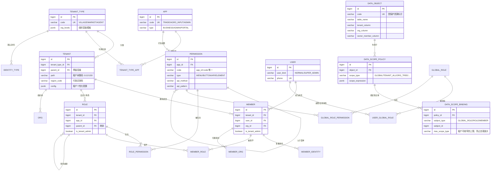

# 01 · 权限框架设计

---

## 一、从需求到模型：逐条映射

先把系统描述里的每一句话翻译成模型约束，确保没有遗漏、也没有臆造。

| # | 需求原文 | 模型约束 | 落地对象 |
|---|---|---|---|
| R1 | 农户以村为租户、商贩以农贸市场为租户、化肥农药商贩以厂/代理商为租户 | 租户有**类型**，类型决定行为差异 | `sys.tenant_type` |
| R2 | 后续可能逐渐添加新的用户类型或租户类型 | 租户类型、身份类型**必须是数据，不能是枚举** | `sys.tenant_type` / `sys.identity_type` 表驱动 |
| R3 | 每种类型用户可使用不同应用；农户可用商贩交易+农资交易，商贩只用商贩交易 | **应用可见范围由租户类型决定** | `sys.tenant_type_app` |
| R4 | 应用是权限的集合体 | 权限**挂载在应用下**，不挂全局 | `sys.permission.app_id` |
| R5 | 每个用户可以有多种身份，可以切换到不同租户 | 用户与租户是多对多，中间实体承载"身份" | `sys.member` + `sys.member_identity` |
| R6 | 功能权限是系统级数据，交给应用打包 | 权限由代码/版本发布，不可运行时由租户新建 | `sys.permission.builtin` + 发布流程 |
| R7 | 用户权限交给租户的自定义角色管理 | 角色是**租户内**实体，且**按应用**划分 | `sys.role(tenant_id, app_id)` |
| R8 | 新创建租户时默认创建管理员角色，管理整个应用权限 | 租户初始化时自动创建角色并授予**该租户类型可用应用的全部权限** | 租户创建领域事件 + `sys.role.is_tenant_admin` |
| R9 | 数据权限是系统级配置，交给超级管理员处理 | 数据范围策略系统预置，超管负责**绑定** | `sys.data_scope_policy` + `sys.data_scope_binding` |
| R10 | 注意超级管理员这个特殊用户 | 超管独立于租户体系，全权且不可回收 | `sys.user_account.user_kind` + `sys.user_global_role` |

---

## 二、核心概念辨析（这三层最容易混）

```
用户 User        —— 一个自然人，一个手机号，全局唯一。登录的主体。
成员 Member      —— 一个用户在【某个租户】内的身份。权限的实际授予对象。
身份 Identity    —— 成员在租户内扮演的角色种类：农户 / 商贩 / 农资商贩。
```

**关键：权限永远授予「成员」，不授予「用户」。**

用户 `张三` 在 `王家村`（租户 A）是农户，在 `城东农贸市场`（租户 B）是商贩。
他登录时选择进入租户 A → 上下文中的 `member_id = 张三@王家村` → 只能拿到王家村的权限。
切到租户 B → `member_id = 张三@城东农贸市场` → 权限完全换一套。**这就是"切换到不同租户"。**

> 为什么不让用户直接持角色？因为角色是租户内实体（R7）。用户跨域持有角色会导致租户边界模糊，一旦出现"用户在 A 租户的角色被误用于 B 租户"就是越权事故。用 Member 做隔离带，边界是硬的。

---

## 三、八元权限模型

```
                                    ┌──────────────┐
                                    │  User 用户    │  登录主体 / 自然人
                                    └──────┬───────┘
                                           │ 1:N
                                    ┌──────▼───────────────────┐
                                    │  Member 成员（用户@租户） │  权限授予对象
                                    └──┬───────┬──────────┬────┘
                          belongs to   │       │          │  assigned
                    ┌──────────────────▼──┐    │   ┌──────▼──────────┐
                    │  Tenant 租户         │    │   │  Role 角色       │  租户自定义，按应用
                    │  (村/市场/农资厂)     │    │   └──────┬──────────┘
                    │  └─ TenantType 类型  │    │          │ contains
                    │  └─ Org 组织树       │    │   ┌──────▼──────────┐
                    └─────────┬───────────┘    │   │ Permission 功能权限│ 系统级，应用打包
                              │ N:M            │   └──────┬──────────┘
                    ┌─────────▼───────────┐    │          │ belongs to
                    │  Application 应用    │◄───┴──────────┘
                    │  (权限的集合体)       │
                    └─────────┬───────────┘
                              │ protected by
              ┌───────────────▼─────────────────┐
              │  DataScopePolicy 数据范围策略     │  系统级，超管绑定
              │  ─ binds to Role / Member        │
              │  ─ targets DataObject 受保护资源  │
              └─────────────────────────────────┘
```

**一句话概括**：
> 用户以**成员**身份进入**租户** → 成员被授予租户内的**角色** → 角色包含**应用**下的**功能权限** → 权限执行时叠加**数据范围策略** → 落到**受保护资源**上。

---

## 四、ER 图



---

## 五、鉴权判定流程

### 5.1 登录与租户切换

```
┌─ POST /auth/login（手机号 + 密码）
│
├─ 校验账号 → 签发 JWT，claim 中只放 user_id（不放权限，避免令牌膨胀与权限失效延迟）
│
├─ 查询该用户的全部成员身份：
│     SELECT m.id, m.tenant_id, t.name, tt.code, a.id AS app_id, a.name
│     FROM sys.member m
│     JOIN sys.tenant t   ON t.id = m.tenant_id
│     JOIN sys.tenant_type tt ON tt.id = t.tenant_type_id
│     JOIN sys.tenant_type_app tta ON tta.tenant_type_id = t.tenant_type_id
│     JOIN sys.app a ON a.id = tta.app_id
│     WHERE m.user_id = ? AND m.status = 1 AND t.status = 1
│
├─ 若 user_kind = SUPER_ADMIN → 返回特殊上下文：租户列表 = 全部，应用 = 全部，scope = GLOBAL
│
└─ 返回「身份卡片列表」：[{tenantId, tenantName, apps:[{appId, appCode, appName}]}, ...]

┌─ POST /auth/switch  { tenantId, appId }
│
├─ 校验 user 在该 tenant 下有有效 member，且该 tenant 类型可用该 app
├─ 计算权限快照（见 5.2），写入 Redis：permission:{memberId}:{appId} → Set<String> permissionCode
├─ 计算数据范围快照：datascope:{memberId}:{appId} → Map<objectCode, ScopeRule>
├─ 持久化当前上下文到 sys.user_context（刷新页面/新设备登录可恢复）
└─ 返回新 JWT（claim 增加 member_id / tenant_id / app_id），前端更新路由
```

### 5.2 权限快照计算

```
输入：memberId, appId
│
├─ 1. 若该 member 的 user.kind = SUPER_ADMIN
│      → permissionSet = 全部应用全部权限；dataScope = 恒为 GLOBAL；【短路返回】
│
├─ 2. 若 member.is_tenant_admin = true
│      → permissionSet = 该 app 下全部权限（由租户初始化时授予管理员角色）
│      → 继续走第 3 步合并普通角色权限（允许管理员同时持有其它角色）
│
├─ 3. 查角色（含继承展开）：
│      WITH RECURSIVE role_tree AS (
│          SELECT id FROM sys.role WHERE id IN (
│              SELECT role_id FROM sys.member_role
│              WHERE member_id = ? AND (effective_to IS NULL OR effective_to > now())
│          )
│          UNION
│          SELECT r.id FROM sys.role r JOIN role_tree rt ON r.parent_id = rt.id
│      )
│      SELECT DISTINCT p.code
│      FROM role_tree rt
│      JOIN sys.role_permission rp ON rp.role_id = rt.id
│      JOIN sys.permission p ON p.id = rp.permission_id
│      WHERE p.app_id = ? AND p.status = 1 AND p.deleted_at IS NULL
│
└─ 4. 数据范围：见 5.3
```

> **角色继承用 PG 递归 CTE 一次查完**，不要在 Java/Kotlin 里做多轮查询（N+1）。结果整体缓存到 Redis，失效时机见 5.5。

### 5.3 数据范围计算（多策略叠加 + 优先级）

一个主体可能命中多条策略，规则如下：

1. 按 `subject_type` 精确匹配：`MEMBER` > `ROLE` > `GLOBAL_ROLE`；
2. 同主体多条策略按 `priority` 降序取第一条；
3. 若 `effect = DENY`，直接拒绝（黑名单优先）；
4. 若绑定来自超管且带 `max_scope`，租户内的自定义绑定**只能在 `max_scope` 内收窄**：
   - `GLOBAL` ⊃ `TENANT_ALL` ⊃ `ORG_TREE` ⊃ `ORG_SELF` ⊃ `MEMBER_SELF`
   - 违反则忽略该绑定并**打告警日志**（防止配置错误导致越权）；
5. 未命中任何策略 → 取 `sys.data_object.default_scope_type`（默认 `TENANT_ALL`，**安全默认值**）。

### 5.4 请求鉴权链路

```
Gateway（仅做转发与令牌解析）
   ↓  注入 X-User-Id / X-Member-Id / X-Tenant-Id / X-App-Id 内部头（外部伪造一律剥离）
业务服务 SecurityWebFilterChain
   ↓  ① 解析 JWT → 还原 UserContext（ThreadLocal / ReactorContext / 协程 CoroutineContext）
   ↓  ② 比对请求路径与方法 → 匹配 sys.permission（api_pattern 支持 Ant 通配符）
   ↓  ③ 校验 permissionCode ∈ 权限快照（Redis）；未匹配到权限的 API 需在白名单，否则拒绝
   ↓  ④ 把 dataScope 规则放进上下文
   ↓
MyBatis 拦截器（TenantInterceptor / DataScopeInterceptor）
   ↓  ⑤ 改写 SQL：强制注入 tenant 条件 + 数据范围条件
   ↓
PG 执行（RLS 作为第二道防线）
```

> **关键点**：上下文传递在 WebFlux/协程里不能用 ThreadLocal。
> 本项目用 **Reactor Context + Kotlin 协程 `CoroutineContext` 元素** 双向桥接，见 `03` 中的 `SecurityContextHolder` 实现。

### 5.5 缓存与失效

| 缓存键 | 内容 | 失效时机 |
|---|---|---|
| `auth:perm:{memberId}:{appId}` | 权限码集合 | 角色变更、成员角色变更、权限发布、租户停用 |
| `auth:scope:{memberId}:{appId}` | 数据范围规则 | 策略绑定变更、成员组织变更 |
| `auth:ctx:{userId}` | 当前租户/应用上下文 | 切换租户 |

失效走**领域事件**（`RolePermissionChangedEvent` / `MemberRoleChangedEvent` / `AppPermissionPublishedEvent`）→ 发布订阅 → 批量删 key。
**禁止**用短 TTL 自动过期糊弄：权限变更必须秒级生效，TTL 过长会造成越权窗口。

---

## 六、租户初始化流程（满足 R8）

```
创建租户 Tenant{type=VILLAGE, name=王家村}
  │
  ├─ 1. 落 sys.tenant，生成 path
  ├─ 2. 按 sys.tenant_type.org_levels 模板创建默认组织根节点（如"王家村"本级 + 各村民小组）
  ├─ 3. 查该租户类型的可用应用：SELECT app_id FROM sys.tenant_type_app WHERE tenant_type_id = ?
  │
  └─ 4. 对每个 app，创建管理员角色：
        INSERT sys.role(tenant_id, app_id, code='TENANT_ADMIN', name='租户管理员',
                        is_tenant_admin=true, builtin=true)
        INSERT sys.role_permission   -- 授予该 app 下全部 permission
        INSERT sys.data_scope_binding(policy=(该 app 下各 object 的 TENANT_ALL 策略),
                                      subject_type='ROLE', subject_id=新角色id)

创建首个成员（邀请人/创建人）
  └─ member.is_tenant_admin = true，并绑定 TENANT_ADMIN 角色
```

**注意**：管理员角色的权限是**建租户那一刻的快照**。后续应用新增权限时，需要：
- 方案 A（默认）：`builtin` 管理员角色**自动跟随**——角色权限表中不落记录，而是在鉴权时 `is_tenant_admin=true 短路返回全部权限`（见 5.2 第 2 步）。这样新权限自动生效。
- 方案 B：发布新权限时跑一次批量补授权任务。
- 👉 采用**方案 A**，更省心，且天然满足"管理整个应用权限"。

---

## 七、扩展点设计（应对 R2「后续添加新用户类型/租户类型」）

新增一种租户类型（如"合作社"）时，**零代码改动**，只需数据操作：

1. `INSERT sys.tenant_type(code='COOP', org_levels=[...])`
2. `INSERT sys.tenant_type_app` 关联它能用哪些应用
3. `INSERT sys.identity_type(code='COOP_MEMBER', tenant_type_id=?)`
4. 如果它的业务数据需要新的数据权限规则，`INSERT sys.data_object` + `INSERT sys.data_scope_policy`

新增一个应用（如"农机租赁"）：
1. `INSERT sys.app`
2. 权限由代码中的 `permission.yml` 声明，随应用启动时**自动同步**（upsert by `app_id + code`，`builtin=true` 不可人工删改）
3. `INSERT sys.tenant_type_app` 决定哪些租户类型可见

> 这套"表驱动 + 启动同步"是让系统能持续演进的关键。所有会变的东西都不要写死成枚举。

---

## 八、安全红线

1. **拦截器是兜底，不是可选**：租户条件由拦截器强制注入，业务代码即使手写 where 也不会重复或冲突（拦截器做幂等判断：SQL 中已有该表租户条件则跳过）。
2. **数据范围收紧为默认**：查不到策略时用最严格的 `TENANT_ALL`，宁可看不到，不能看多了。
3. **超管不参与业务**：超管账号禁止出现在 `sys.member` 中，从数据层杜绝"超管持有业务身份"。
4. **上下文头必须从网关剥离**：`X-Tenant-Id` 等内部头，网关入口一律 strip，只认 JWT。
5. **全量审计**：权限变更、租户切换、数据范围绑定变更写入 `sys.audit_log`，按月分区，保留 3 年。
6. **切换租户必须换令牌**：不允许在同一个 JWT 里塞多个租户上下文，避免上下文混淆。
